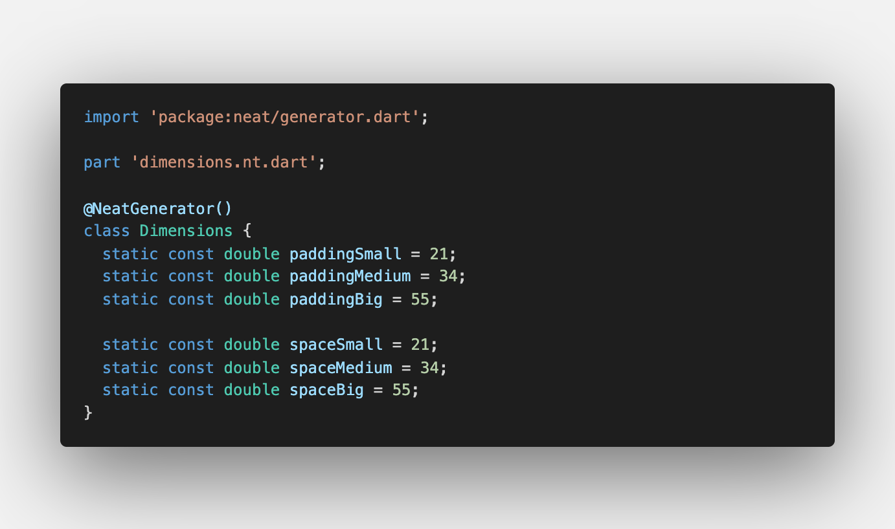

# Neat
Welcome to Neat, a utility package that helps doing cleaner Flutter code.

If you like Neat, don't forget to leave a ⭐️ on the repo and share the package !




# Motivation

As the code grow, Flutter's widget trees quickly becomes difficult to read. Neat package is designed to make the code easier to read by introducing convenient solutions to improve common patterns.

Neat is just a collection of utility functions and code generator so it hasn't any impact on performances. Its just a matter of efficiently and readability.

Note that every features of neat are independents. If you don't like one of them, just ignore it. 

Actually, neat provide 4 types of helpers and widgets:
- **Text helpers** that helps you create headlines/subtitles/bodyTexts
- **Theme accessor** for easily access theme's data
- **Space widgets**, widgets generated from your data that inherit from SizedBox
- **Padding helpers**, helper class generated from your data that inherit from EdgeInsets class

# Summary

//TODO: finish summary

* <a href="#installation">Installation</a>
* <a href="#text-helpers">Text helpers</a>
* <a href="#theme-accessors">Theme accessors</a>
* <a href="#generated-helpers">Neat generator</a>
  * <a href="#space-widgets">Space widgets</a> 
  * <a href="#padding-helpers">Padding helpers</a> 


# How to use
## Install

Install Neat by running following command:
```
flutter pub add neat
```
If you want to use the Neat's code generator, you will need your typical build_runner/code-generator setup. Run the following command to add build_runner package to your dev dependencies:
```
flutter pub add build_runner -dev
```
Theses will add the following dependencies to your `pubspec.yaml` file:
```
# pubspec.yaml
dependencies:
  neat:

dev_dependencies:
  build_runner:
```

# Features

Neat has to distinct parts:
* A collection of helpers and widgets, that you can import with `import 'package:neat/neat.dart';`

* A code generator, that you can import with `import 'package:neat/generator.dart';`

## Text helpers

In most flutter applications, you define TextStyles in your material `ThemeData` and then to create, for example, a Headline1, you should do the following:
```
Text(
    "Headline1",
    style: Theme.of(context).textTheme.headline1,
),
```
If you wants to override some properties of the style its get even worth:
```
Text(
  "Headline1",
  style: Theme.of(context)
      .textTheme
      .headline1
      ?.copyWith(color: Colors.red),
),
```
Neat introduce a collection of extension on `BuildContext` that simplify the creation of headlines and other types of text defined in material textTheme:
```
import 'package:neat/neat.dart';

// It's that simple !
context.headline1("Headline1")

// You can override the style
context.headline1(
    "Headline1",
    style: TextStyle(color: Colors.gold),
),
```

Every text types are available:
```
context.headline1("Headline1"),
context.headline2("Headline2"),
context.headline3("Headline3"),
context.headline4("Headline4"),
context.headline5("Headline5"),
context.headline6("Headline6"),
context.subtitle("Subtitle"),
context.bodyText("BodyText"),
context.caption("caption"),
context.overline("overline"),
//textTheme.button has been renamed to avoid confusions
context.buttonText("button"),
```

All methods have same properties than regular Text widget:
```
context.headline1(
    Headline1,
    key: key,
    style: style,
    strutStyle: strutStyle,
    textAlign: textAlign,
    textDirection: textDirection,
    locale: locale,
    softWrap: softWrap,
    overflow: overflow,
    textScaleFactor: textScaleFactor,
    maxLines: maxLines,
    semanticsLabel: semanticsLabel,
    textWidthBasis: textWidthBasis,
    textHeightBehavior: textHeightBehavior,
    weight: weight,
),
```

## Theme accessors
Without Neat, you access ThemeData, textTheme and colorScheme in the following way:
```
Theme.of(context);
Theme.of(context).textTheme;
Theme.of(context).colorScheme;
```
Neat introduce this alternative way to access your theme:
```
import 'package:neat/neat.dart';

context.theme;
context.textTheme;
context.colorScheme;
```

## Code Generator
When you want to keep your spacing and padding consistent across your app, you often end up with a Dimension class holding all your variables at the same place, like this:
```
class Dimensions {
    static double paddingSmall = 8;
    static double paddingMedium = 13;
    static double paddingBig = 21;

    static double spaceSmall = 13;
    static double spaceMedium = 21;
    static double spaceBig = 34;
}
```
Then you use theses value in your app:
```
const SizedBox(height: Dimensions.spaceSmall),
Padding(
    padding: const EdgeInsets.only(
      top: Dimensions.paddingMedium, 
      left: Dimensions.paddingMedium,
    ),
    child: ...,
),
```
Neat helps you pushing it further by generating specialized helpers and widgets based on your data class, without wasting time coding it yourself:
```
//Generated Space widget, inherit from SizedBox class,
const SpaceSmall.h(),

Padding(
  //Generated Padding helper, inherit form EdgeInsets class
  padding: PaddingMedium(top | left),
  child: ...,
)
```
The generator is flexible and let you configure generated widget names, filters what field to include or exclude from generation, etc. See Generator Options for more details about generation options. 

### basic usage
First, make sure you have installed the build_runner package.

Then, create a Dimensions class and annotate it with `@Neat.generate`. Neat generator will generate both spacing widgets and padding helpers for classes annotated with it.

**dimensions.dart**
```
import 'package:neat/generator.dart';

part 'dimensions.nt.dart';

@Neat.generate
class Dimensions {
  static const double spaceSmall = 21;
  static const double spaceMedium = 34;
  static const double spaceBig = 55;

  static const double paddingSmall = 21;
  static const double paddingMedium = 34;
  static const double paddingBig = 55;
}
```
NeatGenerator let you specify some options to control the generator behavior. To set generator config, use `@NeatGenerator(your_options)`instead of `@Neat.generate` annotation.
```
@NeatGenerator(
  //padding helpers generator options
  //if null, padding helpers will not be generated
  padding: GeneratePadding(
    //put padding generator options here
  ),

  //space widgets generator options
  //if null, space widgets will not be generated
  space: GenerateSpace(
    //put space generator options here
  ),
)
class Dimensions {
  ...
}
```
You can also use separated class for padding and spaces thanks to `Neat.generatePadding` and `@Neat.generateSpace` annotations. They both have a version that takes options as parameters, respectively `@GeneratePadding(...)` and `@GenerateSpace(...)`. See below for more information about generators options.
```
// dimensions.dart
import 'package:neat/generator.dart';

part 'dimensions.nt.dart';

@Neat.generateSpace
class Spaces {
  static const double spaceSmall = 21;
  static const double spaceMedium = 34;
  static const double spaceBig = 55;
}

@Neat.generatePadding
class Paddings {
  static const double paddingSmall = 21;
  static const double paddingMedium = 34;
  static const double paddingBig = 55;
}
```
Then you can run the generator with the following command:
```
flutter pub run build_runner build
```
I recommend to use the option `--delete-conflicting-outputs` to avoid problems during builds.
Note that like most code-generators, Neat will need you to both import the annotation (meta) and use the part keyword on the top of your files.
As such, a file that wants to use Neat's code generator will start with:
```
import 'package:neat/generator.dart';

part 'my_file.nt.dart';
```

### Ignore lint warnings on generated files
Depending on your lint options, Neat Generator may cause your linter to report warnings.

The solution to this problem is to tell the linter to ignore generated files, by modifying your analysis_options.yaml:
```
analyzer:
  exclude:
    - "**/*.nt.dart"
```

### Space Widgets
Space Widget represent a blank space in your app. This widget inherit from SizedBox and define 3 constructors with pre-filled height and width values, based on data in your value class.
Space widgets are generated from `static const double` fields of a value class annotated with one of the Neat generator's annotations.

If you have a global dimensions class for both padding and space generation you can use `@Neat.generate` annotation to generate space widgets.
By default, it will use all fields starting with "space" for generation. You can specify Space Generator options with the annotation `@NeatGenerator`. See <a href="#Space widget generator options">Space widget generator options</a> for more information about available options.
```
@NeatGenerator(
  space: GenerateSpace(yourOptions)
)
class Dimensions {
  ...
}
```

If you have a separated class for space values, you can use `@Neat.generateSpace` annotation. By default this annotation will use all fields of the class to generate space widgets. You can customize it's behavior using `@GenerateSpace(options)`annotation.

#### Example
**dimensions.dart**
```
import 'package:neat/generator.dart';

part 'dimensions.nt.dart';

@Neat.generate
class Dimensions {
  static const double spaceSmall = 21;
  static const double spaceMedium = 34;
  static const double spaceBig = 55;
}
```
**main.dart**
```
import 'dimensions.dart';

const SpaceSmall();     //h: 21, w: 21
const SpaceMedium.w();  //h: 0, w: 34
const SpaceBig.h();     //h: 55, w: 0
```

#### Implementation details
Generated Space widgets will follow this implementation: 
```
class SpaceSmall extends SizedBox {
  const SpaceSmall({Key? key})
      : super(
          height: 21,
          width: 21,
          key: key,
        );

  const SpaceSmall.w({Key? key})
      : super(
          height: 0,
          width: 21,
          key: key,
        );

  const SpaceSmall.h({Key? key})
      : super(
          height: 21,
          width: 0,
          key: key,
        );
}
```

#### Space widget generator options
**classRadical: String? = "Space"**<br/>
The base name of widget that will be generated.

**generateForFieldStartingWith: String? = "space"**<br/>
If not-null, generator will only generate Space widget for field where `fieldName.startsWith(generateForFieldStartingWith) == true`.If null, every fields of the class will be used to generate a corresponding widget.

**removePrefix: bool = false**<br/>
Remove prefix specified by generateForFieldStartingWith parameter form fieldName.

**radicalFirst: bool = true**<br/>
Specify if classRadical should be printed before or after the fieldName 

**avoidPrefixRepetition: bool = true**<br/>
If true, remove the beginning of field name if its match `classRadical`.

### Padding helpers
PaddingHelpers inherit from EdgeInsets class and define new constructors with pre-filled values based on data in your value class.
PaddingHelpers are generated from `static const double` fields of a value class annotated with one of the Neat generator's annotations.

If you have a global dimensions class for both padding and space generation you can use `@Neat.generate` annotation to generate padding helpers.
By default, it will use all fields starting with "padding" for generation. You can specify Padding Generator options with the annotation `@NeatGenerator`.
See <a href="#Space widget generator options">Space widget generator options</a> for more information about available options.
```
@NeatGenerator(
  padding: GeneratePadding(yourOptions)
)
class Dimensions {
  ...
}
```
If you have a separated class for padding values, you can use `@Neat.generatePadding` annotation. By default this annotation will use all fields of the class to generate padding. You can customize it's behavior using `@GeneratePadding(options)`annotation (see below).

#### Example
**paddings.dart**
```
import 'package:neat/generator.dart';

part 'paddings.nt.dart';

@Neat.generatePadding
class Paddings {
  static const double padding1 = 21;
  static const double padding2 = 13;
  static const double padding3 = 8;
  static const double padding4 = 5;
  static const double padding5 = 3;
}
```

**main.dart**
```
import 'dimensions.dart';

Container(
  padding: Padding1.all() //EdgeInsets.all(21)
);
Padding(
  padding: Padding2.horizontal() //EdgeInsets.symmetric(horizontal: 13)
);
Padding(
  padding: Padding3.vertical() //EdgeInsets.symmetric(vertical: 8)
);
Padding(
  padding: Padding4(top | left) //EdgeInsets.only(top: 5, left: 5)
);
Padding(
  padding: Padding5.only(top: true, left: true) //EdgeInsets.only(top: 5, left: 5)
);
```

#### Implementation details
Generated padding helpers will follow this implementation: 
```
//generated only if generateBinaryFlagConstructor is true
const right = 0x1000;
const left = 0x0100;
const top = 0x0010;
const bottom = 0x0001;

class PaddingSmall extends EdgeInsets {
  //generated only if generateBinaryFlagConstructor is true
  //usage: PaddingSmall(top | left | right | bottom)
  const PaddingSmall([int padding = 0])
      : super.only(
          left: padding & top == 1 ? 21 : 0,
          right: padding & right == 1 ? 21 : 0,
          top: padding & top == 1 ? 21 : 0,
          bottom: padding & bottom == 1 ? 21 : 0,
        );

  const PaddingSmall.all() : super.all(21);

  const PaddingSmall.only(
      {bool left = false,
      bool right = false,
      bool top = false,
      bool bottom = false})
      : super.only(
          left: left ? 21 : 0,
          right: right ? 21 : 0,
          top: top ? 21 : 0,
          bottom: bottom ? 21 : 0,
        );

  const PaddingSmall.horizontal()
      : super.symmetric(horizontal: 21, vertical: 0);

  const PaddingSmall.vertical() : super.symmetric(vertical: 21, horizontal: 0);

  const PaddingSmall.symmetric({bool horizontal = false, bool vertical = false})
      : super.symmetric(
            horizontal: horizontal ? 21 : 0, vertical: vertical ? 21 : 0);
}
```

#### Padding generator option
**classRadical: String? = "Space"**<br/>
The base name of widget that will be generated.

**generateForFieldStartingWith: String? = "space"**<br/>
If not-null, generator will only generate Space widget for field where `fieldName.startsWith(generateForFieldStartingWith) == true`.If null, every fields of the class will be used to generate a corresponding widget.

**removePrefix: bool = false**<br/>
Remove prefix specified by generateForFieldStartingWith parameter form fieldName.

**radicalFirst: bool = true**<br/>
Specify if classRadical should be printed before or after the fieldName 

**avoidPrefixRepetition: bool = true**<br/>
If true, remove the beginning of field name if its match `classRadical`.

**generateBinaryFlagConstructor: bool = true**<br/>
If true, generate top, left, right and bottom binary flags to enable the syntax `PaddingSmall(top | left | right | bottom)`


# Contributions
**Wants to contribute ?** I'm happy to discuss about what feature to add next !

I've published this package recently, help in one of the following area is appreciated:
 * **Improving the README**: English is not my native language, any helps to improve the quality of the readme are welcome !
 * **Test coverage**: Add some tests, especially for the fieldFilter / widgetNameExtractor is a top priority.
 * **Improve the architecture/ code cleanliness**: Feel free to propose ameliorations, but i reserve myself the right to accept or reject them.
 * **Improve the code generator configuration**: Make code generators more flexible by adding more generation options. Parser is actually pretty basic and it probably need a refacto.

