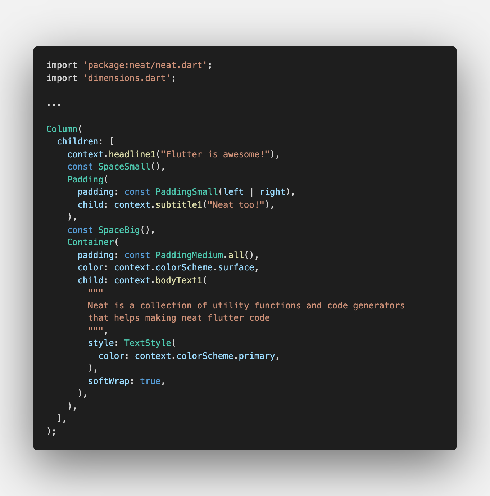

# Neat
Welcome to Neat, a utility package that helps doing cleaner Flutter code.

If you like Neat, don't forget to leave a ⭐️ on the repo and share the package !



# Motivation

As the code grow, Flutter's widget trees quickly becomes difficult to read. Neat package is designed to make the code easier to read by introducing convenient solutions to improve common patterns.

Neat is just a collection of utility functions and code generator so it hasn't any impact on performances. Its just a matter of efficiently and readability.

Note that every features of neat are independents. If you don't like one of them, just ignore it. 

Actually, neat provide 4 types of helpers and widgets:
- **Text helpers** that helps you create headlines/subtitles/bodyTexts
- **Theme accessor** for easily access theme's data
- **Space widgets**, widgets generated from your data that inherit from SizedBox
- **Padding helpers**, helper class generated from your data that inherit from EdgeInsets class

# Summary

//TODO: finish summary

* <a href="#installation">Installation</a>
* <a href="#text-helpers">Text helpers</a>
* <a href="#theme-accessors">Theme accessors</a>
* <a href="#generated-helpers">Neat generator</a>
  * <a href="#space-widgets">Space widgets</a> 
  * <a href="#padding-helpers">Padding helpers</a> 


# How to use
## Install

Install Neat by running following command:
```
flutter pub add neat
```
If you want to use the Neat's code generator, you will need your typical build_runner/code-generator setup. Run the following command to add build_runner package to your dev dependencies:
```
flutter pub add build_runner -dev
```
Theses will add the following dependencies to your `pubspec.yaml` file:
```
# pubspec.yaml
dependencies:
  neat:

dev_dependencies:
  build_runner:
```

# Features

Neat has to distinct parts:
* A collection of opinionated helpers and widgets, that you can import with `import 'package:neat/neat.dart';`

* A code generator, that you can import with `import 'package:neat/generator.dart';`

## Text helpers

In most flutter applications, you define TextStyles in your material `ThemeData` and then to create, for example, a Headline1, you should do the following:
```
Text(
    "Headline1",
    style: Theme.of(context).textTheme.headline1,
),
```
If you wants to override some properties of the style its get even worth:
```
Text(
  "Headline1",
  style: Theme.of(context)
      .textTheme
      .headline1
      ?.copyWith(color: Colors.red),
),
```
Neat introduce a collection of extension on `BuildContext` for this purpose:
```
import 'package:neat/neat.dart';

// It's that simple !
context.headline1("Headline1")

// You can override the style
context.headline1(
    "Headline1",
    style: TextStyle(color: Colors.gold),
),
```

Every text types are available:
```
context.headline1("Headline1"),
context.headline2("Headline2"),
context.headline3("Headline3"),
context.headline4("Headline4"),
context.headline5("Headline5"),
context.headline6("Headline6"),
context.subtitle("Subtitle"),
context.bodyText("BodyText"),
context.caption("caption"),
context.overline("overline"),
//textTheme.button has been renamed to avoid confusions
context.buttonText("button"),
```

methods have same properties than regular Text widget
```
context.headline1(
    Headline1,
    key: key,
    style: style,
    strutStyle: strutStyle,
    textAlign: textAlign,
    textDirection: textDirection,
    locale: locale,
    softWrap: softWrap,
    overflow: overflow,
    textScaleFactor: textScaleFactor,
    maxLines: maxLines,
    semanticsLabel: semanticsLabel,
    textWidthBasis: textWidthBasis,
    textHeightBehavior: textHeightBehavior,
    weight: weight,
),
```

## Theme accessors

Without Neat, you access ThemeData, textTheme and colorScheme in the following way:
```
Theme.of(context);
Theme.of(context).textTheme;
Theme.of(context).colorScheme;
```
Neat introduce this alternative way to access your theme:
```
import 'package:neat/neat.dart';

context.theme;
context.textTheme;
context.colorScheme;
```

## Code Generator
When you want to keep your spacing and padding consistent across your app, you often end up with a Dimension class holding all your variables at the same place, like so:
```
class Dimensions {
    static double paddingSmall = 8;
    static double paddingMedium = 13;
    static double paddingBig = 21;

    static double spaceSmall = 13;
    static double spaceMedium = 21;
    static double spaceBig = 34;
}
```
Then you use theses value in your app like so:
```
SizedBox(width: Dimensions.space1),
Padding(
    padding: EdgeInsets.all(Dimensions.paddingSmall),
    child: ...,
),
```
Neat helps you pushing it further by generating specialized helpers and widgets based on your data class. The generator is flexible and let you configure generated widget names, filters what field to include or exclude from generation, etc. See Generator Options for more details about generation options. 

### basic usage
Use the following command to run the code generator:
```
flutter pub run build_runner build
```
I recommend to use the option `--delete-conflicting-outputs` to avoid problems during builds.

Note that like most code-generators, Neat will need you to both import the annotation (meta) and use the part keyword on the top of your files.

As such, a file that wants to use Neat's code generator will start with:
```
import 'package:neat/generator.dart';

part 'my_file.nt.dart';
```

A full example would be:
```
// dimensions.dart
import 'package:neat/generator.dart';

part 'dimensions.nt.dart';

@NeatGenerator
class Dimensions {
  static const double spaceSmall = 21;
  static const double spaceMedium = 34;
  static const double spaceBig = 55;
  static const double paddingSmall = 21;
  static const double paddingMedium = 34;
  static const double paddingBig = 55;
}
```


### Ignore lint warnings on generated files

It is likely that the code generated by Neat will cause your linter to report warnings.

The solution to this problem is to tell the linter to ignore generated files, by modifying your analysis_options.yaml:
```
analyzer:
  exclude:
    - "**/*.nt.dart"
```

### generator options

//TODO: options explenations

### Space Widgets

Space Widget represent a blank space in your app. This widget inherit from SizedBox and define 3 constructors with pre-filled height and width values, based on data in your DataClass.

**dimensions.dart**
```
import 'package:neat/generator.dart';

part 'dimensions.nt.dart';

@Neat.generate
class Dimensions {
  static const double spaceSmall = 21;
  static const double spaceMedium = 34;
  static const double spaceBig = 55;
}
```

**main.dart**
```
import 'dimensions.dart';

const SpaceSmall();     //h: 21, w: 21
const SpaceMedium.w();  //h: 0, w: 34
const SpaceBig.h();     //h: 55, w: 0
```

#### Implementation details
Generated Space widgets will follow this implementation: 
```
class SpaceSmall extends SizedBox {
  const SpaceSmall({Key? key})
      : super(
          height: 21,
          width: 21,
          key: key,
        );

  const SpaceSmall.w({Key? key})
      : super(
          height: 0,
          width: 21,
          key: key,
        );

  const SpaceSmall.h({Key? key})
      : super(
          height: 21,
          width: 0,
          key: key,
        );
}
```

### Padding helpers

PaddingHelpers class inherit from EdgeInsets class and define new  constructors with pre-filled values based on data in your Dimension class

//TODO exemples

# Contributions

**Wants to contribute ?** I'm happy to discuss about what feature to add next !
This package have been recently published, actually i'm focusing on:

 * improving the readme/documentation
 * find and correct bugs
 * Test coverage
 * better fieldName parse 

Any PR are welcomes !

